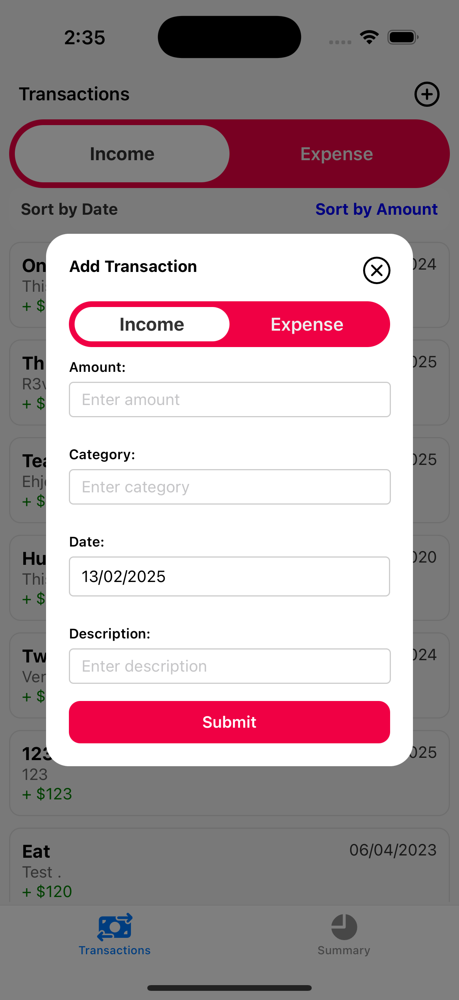

# Personal Finance Tracker App

A simple React Native application to track personal finances, focusing on income and expenses. This app allows users to add transactions, view a list of transactions, and see a summary of their finances for the current month.

## Features

- **Add Transactions:**
  - Form to input transaction details (type: income/expense, amount, category, date, description).
- **Transaction List:**
  - Display a list of added transactions.
  - Sort and filter options based on date and type.
- **Summary View:**
  - Show a summary of total income and expenses for the current month.
  - Visual representation (pie chart) of expenses by category.

## Requirements

- React Native
- Node.js
- Expo
- `react-native-chart-kit` for pie charts
- `@react-native-async-storage/async-storage` for local storage

## ⏳ Time Spent

⌛ **Total Time Taken:** 4 hours

## Installation

1. **Clone the repository:**

   ```bash
   git clone https://github.com/ahmedabdelmageed69/Personal-Finance-Tracker-App.git
   cd personal-finance-tracker-app

   ```

2. **Install dependencies:**

   ```bash
   npm install

   ```

3. **Run the app:**

   1. For iOS:

      ```bash
        npx react-native run-ios

      ```

   2. For Android:

      ```bash
         npx react-native run-android
      ```

## 📸 Screenshots

  
